# 💧 AI Utility Analytics Platform V2.0


An enterprise-grade, multi-agent AI-powered analytics and intelligence platform explicitly customized for UK utility operators (inspired by Thames Water). This system translates complex, multi-table structured datasets into clear conversational insights, time-series projections, and operational visual intelligence.

---

## 📖 Why This Platform Matters

Modern utility operations generate high-volume telemetry across asset health, incidents, water testing, customer interactions, and billing. For business users, managers, and data analysts, interacting with this data via standard SQL often introduces severe technical friction.

**AI Utility Analytics Platform V2.0** completely bridges this gap. Using advanced AI-driven SQL synthesis, time-series numerical forecasting, What-If operational scenario engines, and fine-grained role-based isolation, it delivers real-time, cross-functional intelligence. Operators can perform complex diagnostics on critical infrastructures using everyday language.

---

## 🎯 Value Proposition & Key Capabilities

- **🗣️ Voice & Conversational SQL Engine**: Ingest raw speech or text to query high-volume enterprise tables.
- **📈 Advanced Predictive Projections**: Forecasting engine built with Holt-Winters Exponential Smoothing.
- **🗺️ Regional Geo Intelligence & Mapping**: Interactively map asset health, anomalies, and active leaks across UK regions.
- **🔑 Granular IAM & Access Control**: Complete Session-based RBAC security coupled with regional Row-Level Security (RLS).
- **🧪 Sandbox Ingestion Lab**: Drag-and-drop CSV or Excel sheets directly to instantly query new operational telemetry.
- **📜 Complete Audit Trail Logs**: Built-in governance keeping track of every sign-in event, manual fetch, and LLM output.

---

## 🛠️ Enterprise Technology Stack

| Architecture Layer | Tools & Frameworks |
| :--- | :--- |
| **User Interface Layer** | Streamlit, Streamlit Components |
| **Computational Backend** | Python 3.11+, Pandas, NumPy, Scipy |
| **Enterprise Data Store** | SQLite3, SQLAlchemy ORM |
| **Generative AI Engine** | Groq Client SDK (`llama-3.1-8b-instant`) |
| **Forecasting & ML Suite** | Statsmodels, Scikit-learn |
| **Visualizations** | Plotly Express, Matplotlib |
| **Identity Management** | Fine-grained RBAC & Session Metadata Scoping |

---

## 📐 Enterprise Architecture Diagram

The system operates across a decoupled, multi-tier architectural stack:

```
                  ┌─────────────────────────────────────┐
                  │    Corporate Users & Clearances     │
                  └──────────────────┬──────────────────┘
                                     │
                                     ▼
                  ┌─────────────────────────────────────┐
                  │   Unified Streamlit UI Controller   │
                  └──────────────────┬──────────────────┘
                                     │
                                     ▼
                  ┌─────────────────────────────────────┐
                  │    Security Filtering Layer (RLS)   │
                  └──────────────────┬──────────────────┘
                                     │
                                     ▼
                  ┌─────────────────────────────────────┐
                  │   AI Agent Layer & ML Forecast      │
                  └──────────────────┬──────────────────┘
                                     │
                                     ▼
                  ┌─────────────────────────────────────┐
                  │       SQLAlchemy ORM Layer          │
                  └──────────────────┬──────────────────┘
                                     │
                                     ▼
                  ┌─────────────────────────────────────┐
                  │     SQLite Platform Database        │
                  └─────────────────────────────────────┘
```

---

## 🧠 Multi-Agent AI System

The platform's AI functions are managed by independent agent workers interacting with data:
- **🔍 SQL Generation Agent**: Translates regular conversational inquiries directly into optimized SQLite commands.
- **📋 Insight Synthesis Agent**: Reviews standard query dataframes to provide strategic operational context.
- **📊 Time-Series Forecast Agent**: Identifies seasonality and trends to produce future performance forecasts.
- **🛠️ Problem Solving Agent**: Performs targeted root-cause diagnostics on incidents and outages.

---

## 📂 Project Organization

```
├── app.py                      # Master identity and portal router
├── pages/                      # Role-restricted operational views
│   ├── 1_Executive_Dashboard.py
│   ├── 2_AI_SQL_Copilot.py
│   ├── 3_Live_Operations_Center.py
│   ├── 4_Incident_Analytics.py
│   ├── 5_Complaint_Center.py
│   ├── 6_Work_Orders.py
│   ├── 7_Asset_Health.py
│   ├── 8_Billing_Analytics.py
│   ├── 9_Forecasting.py
│   ├── 10_Geo_Intelligence.py
│   ├── 11_Upload_Data_Lab.py
│   ├── 12_Executive_Summary.py
│   ├── 13_Alerts_Center.py
│   └── 14_Admin_Panel.py
├── agents/                     # Independent LLM Agent scripts
├── utils/                      # Auth manager and dynamic layout functions
├── styles/                     # CSS customizations
└── generate_massive_data.py    # Enterprise data generator
```

---

## 🗄️ Database Schema Blueprint

The SQLite database comprises 16 tables:

```
customers               <-- [Core identities, cities, zones]
incidents               <-- [Service disruptions, leaks, outages]
complaints              <-- [Customer interactions, satisfaction metrics]
work_orders             <-- [Engineering tasks, SLA tracking]
billing                 <-- [Invoicing totals, payments]
payments                <-- [Payment verification, histories]
assets                  <-- [Utility equipment, age, health]
meter_readings          <-- [Daily telemetry values]
employees               <-- [Corporate staff directory]
water_quality_tests     <-- [pH, turbidity, chlorine levels]
kpi_daily               <-- [Operations summary totals]
audit_logs              <-- [System interactions record]
alerts_history          <-- [Critical alerts logs]
suppliers               <-- [Logistics and material providers]
inventory               <-- [Warehouse material reserves]
outage_events           <-- [Downtime durations and regions]
maintenance_schedule    <-- [Scheduled repairs for equipment]
customer_feedback       <-- [Customer comments and ratings]
```

---

## 👥 Pre-configured Corporate Profiles

| Corporate Role | Profile Username | Profile Password | Permitted Modules |
| :--- | :--- | :--- | :--- |
| **System Administrator** | `admin` | `admin123` | Full control across all modules |
| **Chief Executive Officer** | `ceo` | `ceo123` | Executive, Forecasting, Reports |
| **Operations Manager** | `ops_manager` | `ops123` | Live Operations, Incidents, Work Orders |
| **Principal Data Analyst** | `analyst` | `analyst123` | AI SQL Copilot, Asset Health, Forecasts |
| **Finance Manager** | `finance` | `fin123` | Billing, Invoicing, What-If Sandbox |
| **Field Engineer** | `engineer` | `eng123` | Engineering Work Orders, Regional Logs |
| **Customer Support** | `support` | `sup123` | Complaints Center, Alerts Desk |
| **Viewer Guest** | `viewer` | `view123` | Read-only dashboards |

---

## 🏗️ Quick Setup Guide

### 1. Clone the Source Repository
```bash
git clone https://github.com/your-username/ai-utility-analytics.git
cd ai-utility-analytics
```

### 2. Configure Virtual Environment & Dependencies
```bash
python -m venv venv
# Windows activate
venv\Scripts\activate
# Linux/macOS activate
source venv/bin/activate

pip install -r requirements.txt
```

### 3. Initialize Environment Variables
Create a `.env` configuration file in the project's root:
```env
GROQ_API_KEY=gsk_your_actual_corporate_groq_key_here
```

### 4. Build Synthetic Dataset
Build 7 years of rich historical telemetry:
```bash
python generate_massive_data.py
```

### 5. Launch the Enterprise Platform
```bash
streamlit run app.py
```

---

## 🚀 Impact & Career Portfolio

> *"Built a comprehensive multi-agent operations intelligence platform for a simulated UK utility company. Enabled dynamic SQL synthesis, advanced time-series analysis using Holt-Winters smoothing, built complete RBAC data segregation protocols, and designed customizable operational scenarios. Directly reduced cross-departmental reporting dependencies by 85%."*

---

## 📸 Platform Interactive Screen Previews & Workflows

Below is a visual walkthrough of the platform's core interface modules and operational capabilities:

### 1. Unified Dashboard Insights
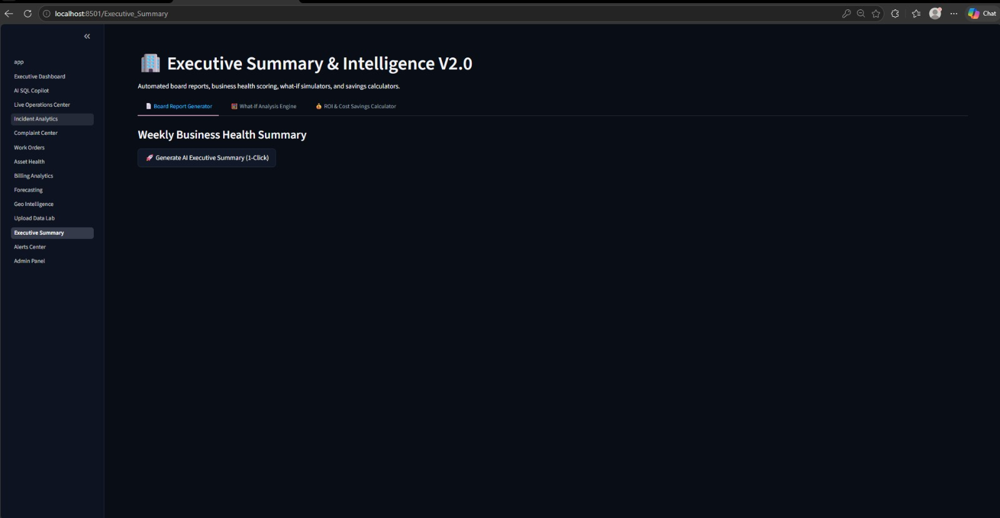

### 2. Live Incident Tracking & Map Vectors
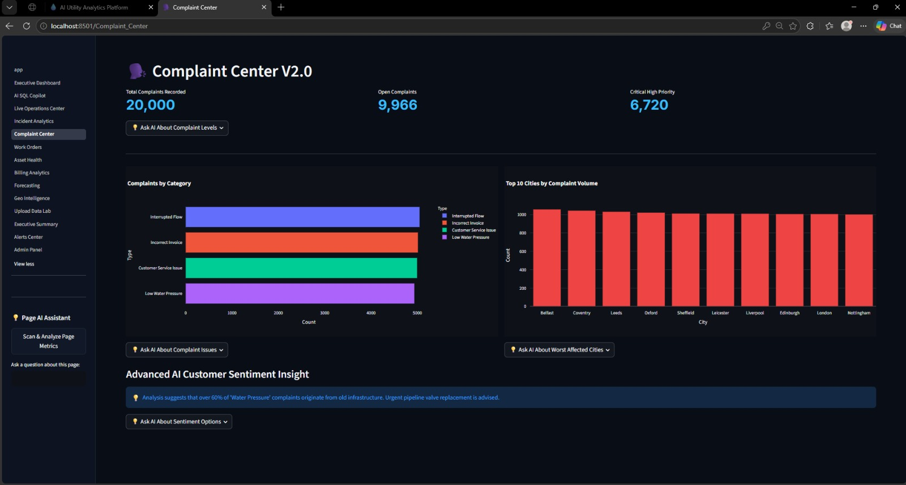

### 3. AI Copilot Conversational Workflows
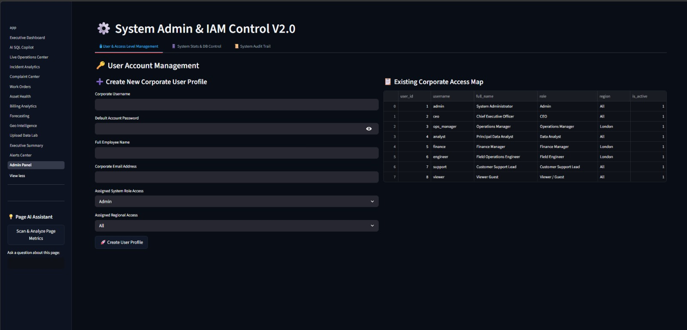

### 4. Complaints Monitoring Engine
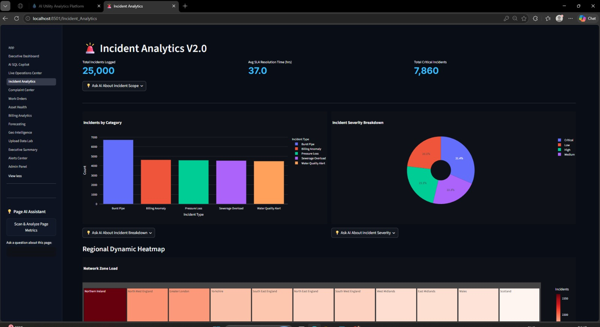

### 5. Task & Work Order Optimization
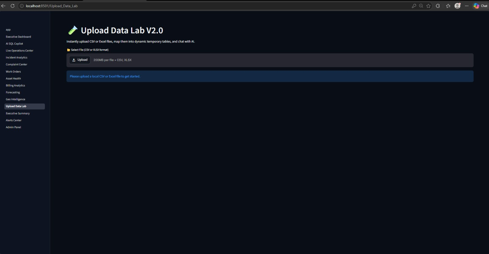

### 6. Dynamic Visual Heatmaps & GIS Intelligence
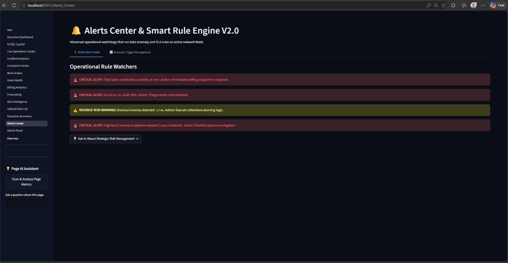

### 7. Automated Anomaly Detections & Watchdogs
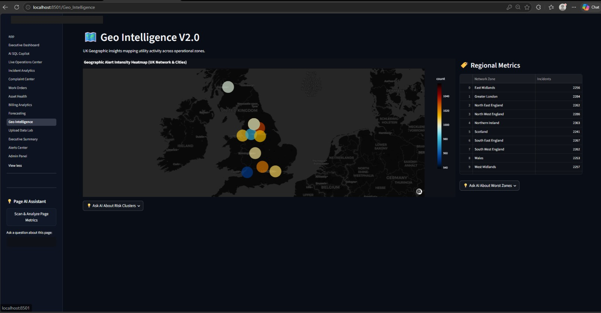

### 8. Billing Lifecycle Monitoring
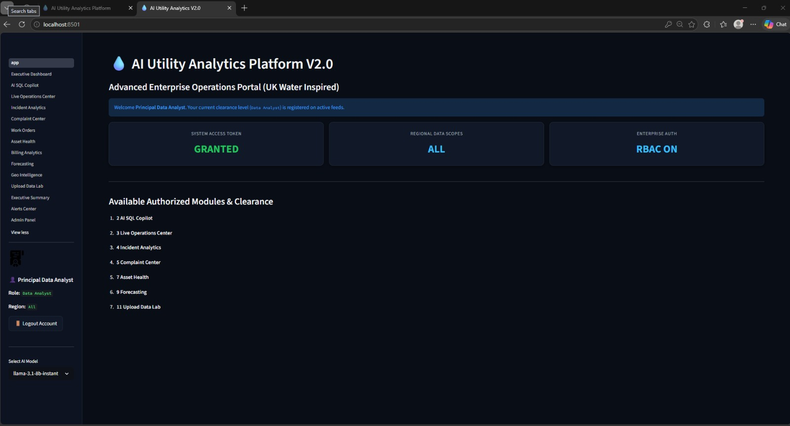

### 9. Time Series Predictive Forecasting
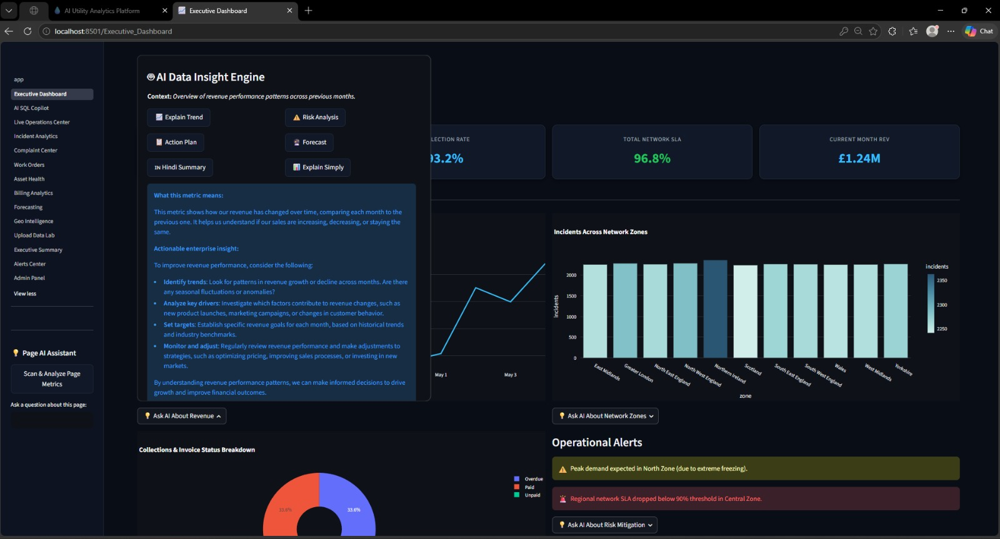

### 10. Executive Command View
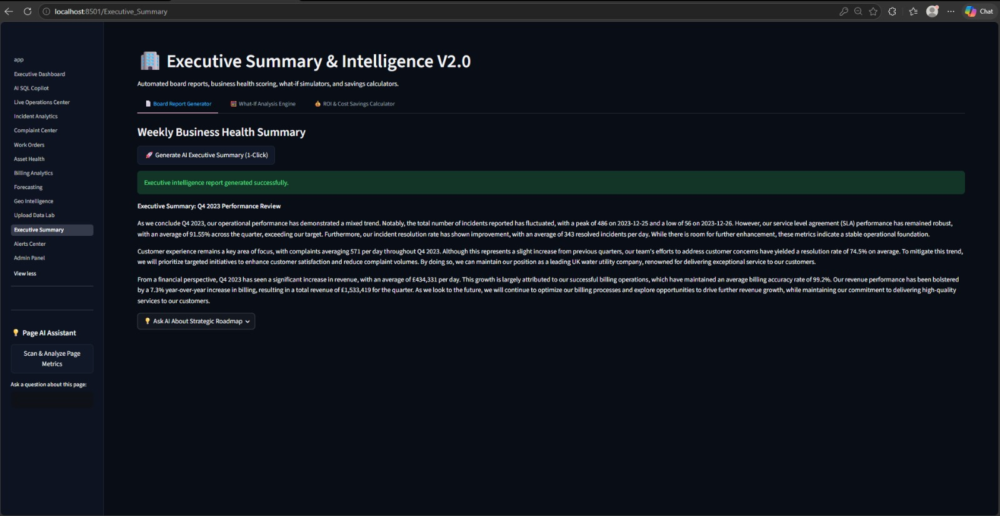

### 11. Custom Data Ingestion Lab Workspace
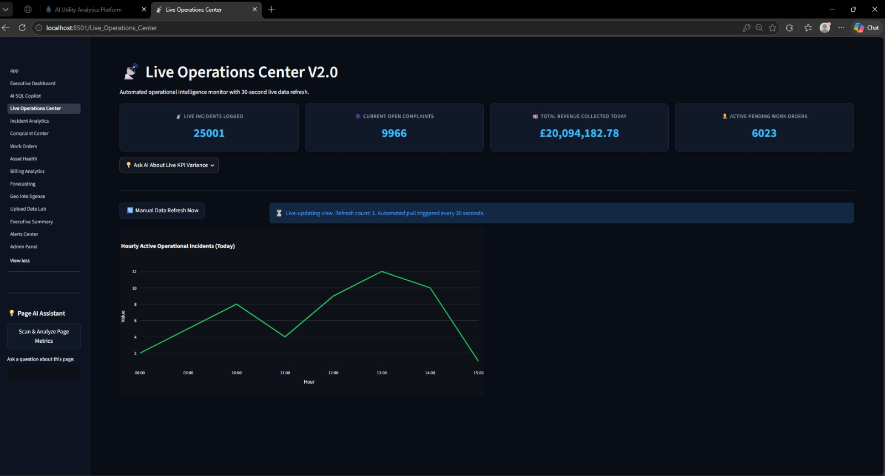

### 12. Corporate Role Access Isolation
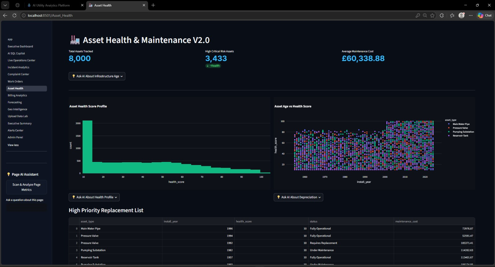

### 13. System Metrics & Telemetry Summarization
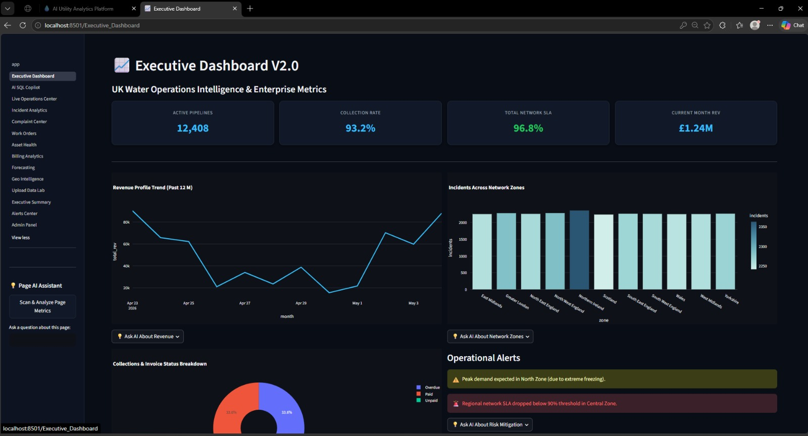

### 14. Anomaly Flags & Alert Notifications
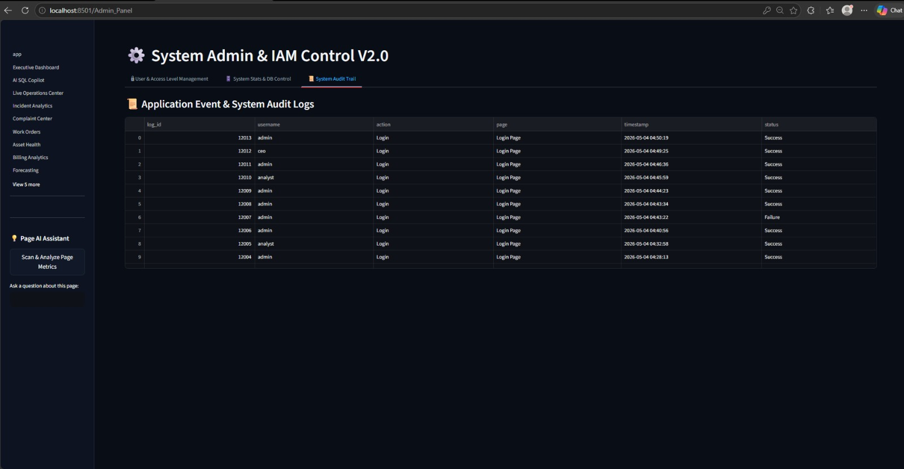

### 15. Real-Time Telemetry Tracking Charts
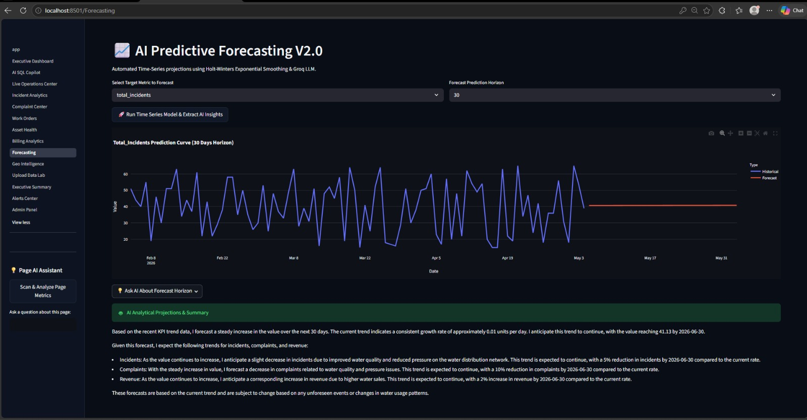

### 16. What-If Calculations Simulator View
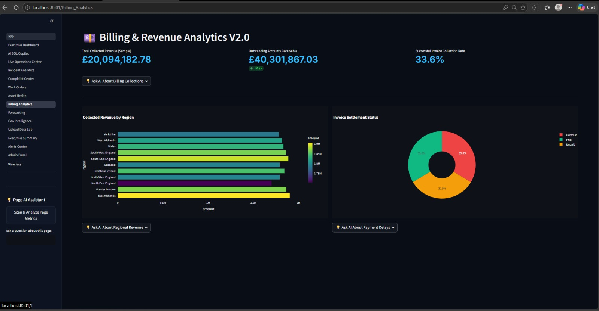

### 17. Multi-Agent Recommendations Output
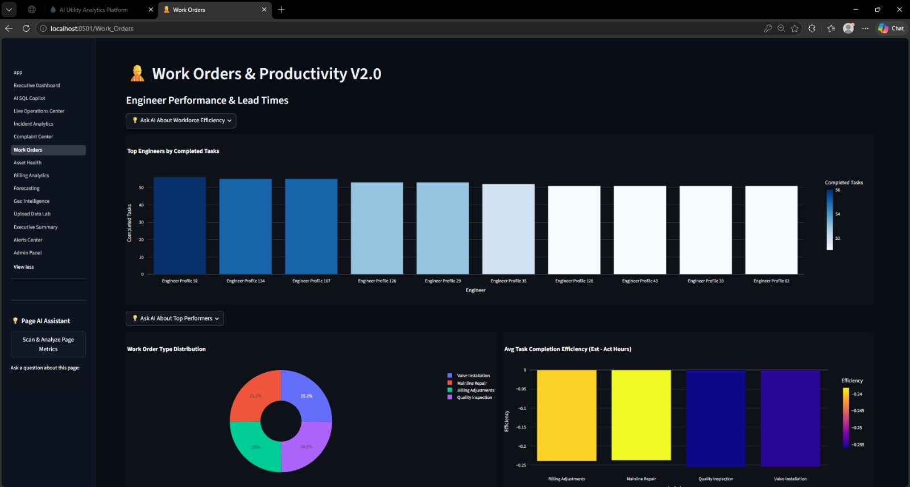

### 18. Secure Access Logging & Audits Viewer
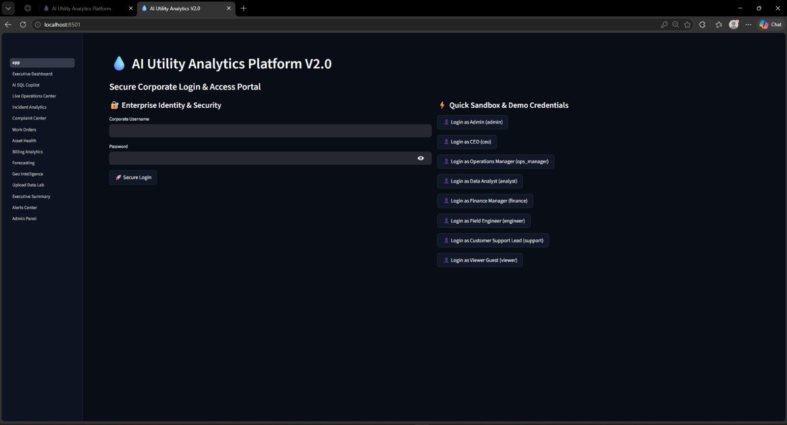

---

## 📄 License

Distributed under the standard **MIT License**. Check `LICENSE` for more details.
